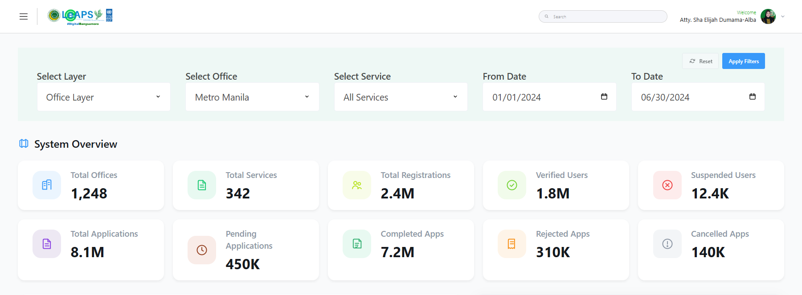
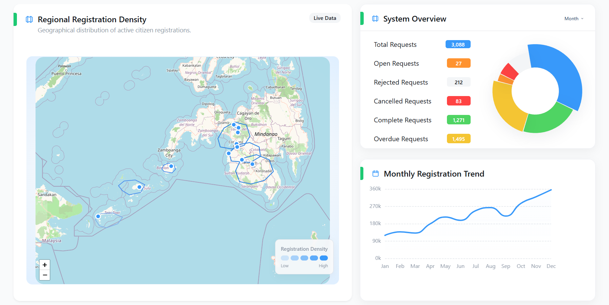
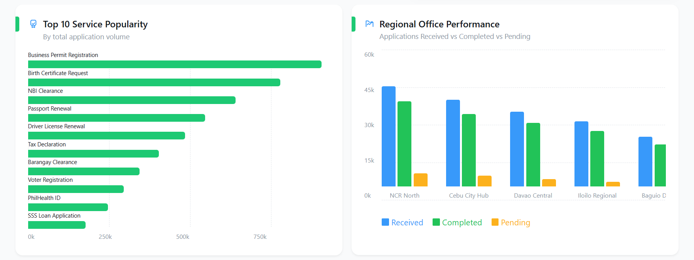
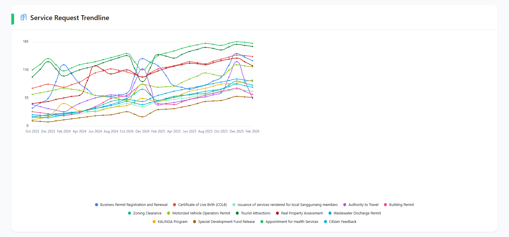
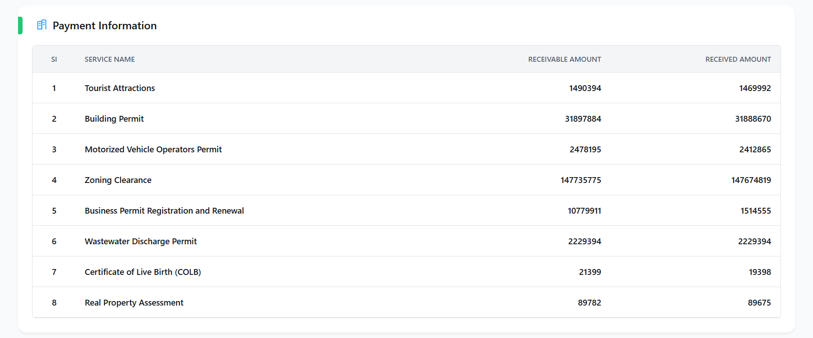
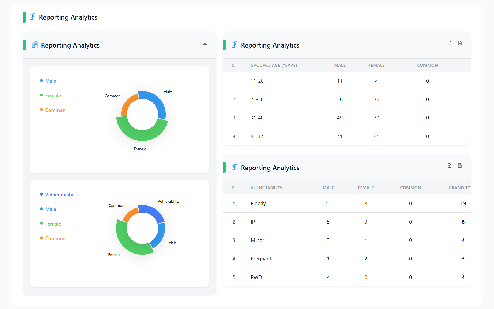
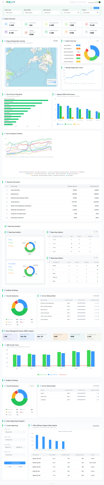
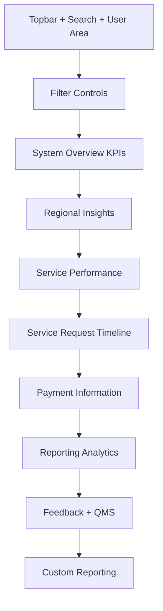
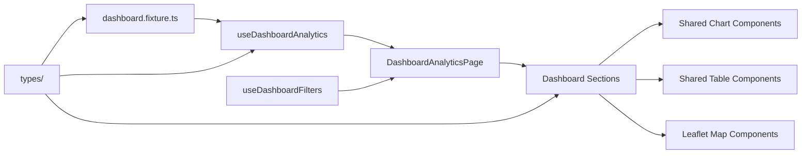

<p align="center">
  
</p>

<h1 align="center">LeAPS</h1>

<p align="center">
  <strong>A portfolio-ready analytics dashboard concept built with Nuxt, Vue, Tailwind, ECharts, and Leaflet.</strong>
</p>

<p align="center">
  Designed to showcase <strong>modern dashboard architecture</strong>, <strong>data visualization</strong>, <strong>geo insights</strong>, and <strong>clean component-driven frontend engineering</strong>.
</p>

<p align="center">
  
  
  
  
  
  
</p>

---

## Showcase Snapshot

| Category | Details |
| --- | --- |
| **Project Type** | Analytics dashboard prototype |
| **Primary Focus** | Operational reporting, KPI monitoring, regional insights, service analytics |
| **Best For Showing** | Dashboard architecture, reusable components, visual hierarchy, design-to-code execution |
| **Stack** | Nuxt 4, Vue 3, Tailwind CSS v4, ECharts, Leaflet, TypeScript |
| **Current Status** | High-fidelity frontend prototype powered by typed fixture data |

---

## Real UI Screenshots

> All screenshots below were captured from the live LeAPS app running locally and curated for cleaner portfolio presentation.

### Dashboard overview



<p align="center"><em>Filter-driven top section with KPI cards and dashboard entry points.</em></p>

<table>
  <tr>
    <td width="50%" valign="top">
      
      <p align="center"><em>Regional insights with map, request breakdown, and monthly trend.</em></p>
    </td>
    <td width="50%" valign="top">
      
      <p align="center"><em>Service performance charts showing popularity and office comparison.</em></p>
    </td>
  </tr>
  <tr>
    <td width="50%" valign="top">
      
      <p align="center"><em>Service request timeline showing multi-series activity trends over time.</em></p>
    </td>
    <td width="50%" valign="top">
      
      <p align="center"><em>Payment information table summarizing receivable and received amounts.</em></p>
    </td>
  </tr>
</table>

### Reporting analytics section



<p align="center"><em>Reporting analytics with demographic summaries, feedback insights, and vulnerability breakdowns.</em></p>

<details>
<summary><strong>Full-page dashboard capture</strong></summary>

<br />



</details>

---

## Why this project stands out in a portfolio

**LeAPS** is not just a starter template with charts dropped in.
It presents a convincing product direction for a large-scale reporting interface, with strong attention to:

- executive-style KPI presentation,
- reusable dashboard sections,
- multi-format data storytelling,
- geographic insight through map visualization,
- scalable separation of data, state, and presentation.

If someone is reviewing this repository for portfolio quality, the main takeaway should be:

> **This project demonstrates how a complex analytics experience can be translated into a clean, modular, production-shaped frontend.**

---

## What this project demonstrates

### 1. Dashboard design translated into real code
The interface feels like a genuine product dashboard rather than a classroom demo.
It includes strong spacing, panel hierarchy, typography, and visual grouping across a large surface area.

### 2. Reusable analytics architecture
Instead of building one oversized page, the project is broken into focused sections and subcomponents, making future extension much easier.

### 3. Mixed visualization patterns
The dashboard combines:

- KPI cards,
- bar charts,
- line charts,
- donut charts,
- tables,
- geographic mapping,
- feedback/rating summaries.

That variety makes the UI feel closer to a real internal analytics platform.

### 4. Product-ready data modeling
Data is currently fixture-based, but it is already shaped through typed contracts and composables, which gives the project a very clean upgrade path toward live APIs.

---

## Experience Highlights

### Smart filter surface
Users can refine the dashboard through:

- layer selection,
- office selection,
- service selection,
- date range controls,
- reset and apply actions.

This gives the page a realistic analytics workflow instead of a static demo feel.

### Executive KPI overview
The system overview section instantly communicates platform scale with cards for offices, services, registrations, verified users, applications, and status counts.

### Regional intelligence
A standout section of the project.
It blends a **Leaflet-based geographic view** with supporting metrics and trend data, helping the dashboard feel spatially aware, not just numerically dense.

### Service performance analysis
The service analytics area compares adoption and office-level operational performance, which makes the product feel useful for management and planning contexts.

### Reporting and QMS storytelling
Demographic reporting, vulnerability breakdowns, QMS analytics, and feedback summaries add strong business context and make the dashboard feel closer to a decision-support product.

---

## Visual Experience Map



---

## Frontend Architecture



This architecture is one of the project’s strongest points because it clearly separates:

- data shape,
- local UI state,
- reusable presentation,
- page composition.

---

## Sections Worth Showcasing

### System Overview
A high-density KPI strip for quickly understanding platform-wide metrics.

### Regional Insights
One of the most portfolio-friendly areas because it combines:

- a geographic surface,
- legend design,
- highlight card treatment,
- trend support.

### Service Performance
Useful for showing comparative chart thinking and practical reporting design.

### Service Request Timeline
A rich multi-series trendline area that adds scale and seriousness to the dashboard.

### Reporting Analytics
Strong for demonstrating donut charts, segmented reporting, and executive-friendly summaries.

### QMS + Feedback
Shows that the product is not only tracking volume, but also quality and user sentiment.

---

## Project Structure

```text
Leaps/
├─ app/
│  ├─ assets/css/main.css
│  ├─ components/dashboard/
│  │  ├─ shared/
│  │  ├─ filters/
│  │  ├─ regional/
│  │  ├─ reporting/
│  │  ├─ qms/
│  │  ├─ payment-information/
│  │  ├─ service-performance/
│  │  ├─ service-request-timeline/
│  │  └─ custom-reporting/
│  ├─ composables/
│  │  ├─ useDashboardAnalytics.ts
│  │  └─ useDashboardFilters.ts
│  ├─ layouts/default.vue
│  └─ pages/index.vue
├─ data/
│  └─ dashboard.fixture.ts
├─ public/
│  └─ figma-assets/
├─ types/
└─ nuxt.config.ts
```

---

## Tech Stack

- **Framework:** Nuxt 4
- **Frontend:** Vue 3
- **Styling:** Tailwind CSS v4
- **Charts:** ECharts + vue-echarts
- **Map Layer:** Leaflet
- **Language:** TypeScript
- **Approach:** component-driven analytics UI with typed fixture data

---

## Honest Project Status

### Already strong
- polished dashboard composition
- thoughtful visual hierarchy
- reusable section components
- typed dashboard contracts
- chart and map integration
- clean data-to-view separation

### Still prototype-stage
- data currently comes from a local fixture
- filter actions are local-state only
- no backend integration yet
- no auth or role system yet
- no persistence layer yet

This honesty actually helps the portfolio value, because it makes the scope clear while still showing the strength of the frontend architecture.

---

## Why it works as a showcase piece

LeAPS is especially valuable in a portfolio because it shows the ability to:

- structure a complex UI clearly,
- build reusable analytics panels,
- combine charts, tables, and maps coherently,
- design with scalability in mind,
- create a frontend that already feels ready for product expansion.

---

## If this project were taken further

Possible next steps:

1. replace fixture data with API-backed composables,
2. persist filters through URL query params,
3. add loading, empty, and error states for each major section,
4. support export/report download actions,
5. introduce role-based or audience-specific dashboards,
6. add automated tests for composables and high-value panels.

---

## Run Locally

```bash
pnpm install
pnpm dev
```

Open:

```text
http://localhost:3000
```

### Available scripts

```bash
pnpm dev
pnpm build
pnpm generate
pnpm preview
```

---

## Final Note

A default starter README would undersell this repository.
This project is much better presented as a **portfolio-grade analytics dashboard concept** that highlights product thinking, interface design, and modular frontend engineering.

That is the story this README is designed to communicate.
